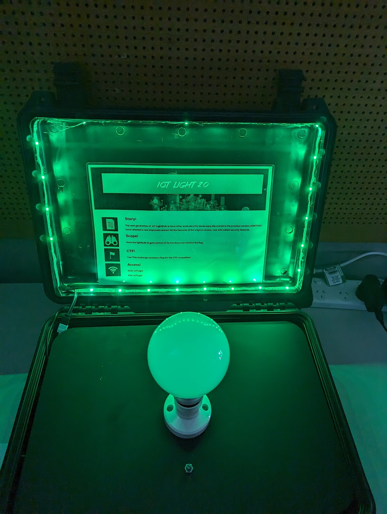
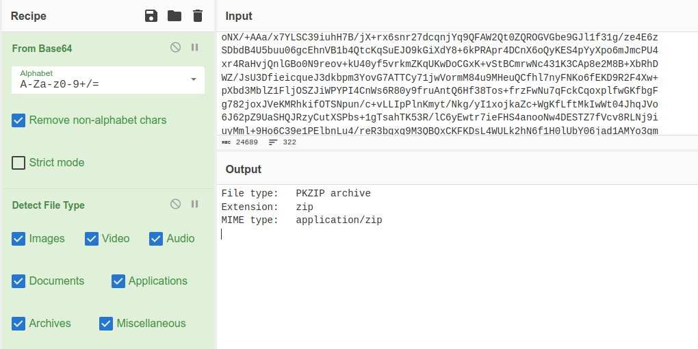
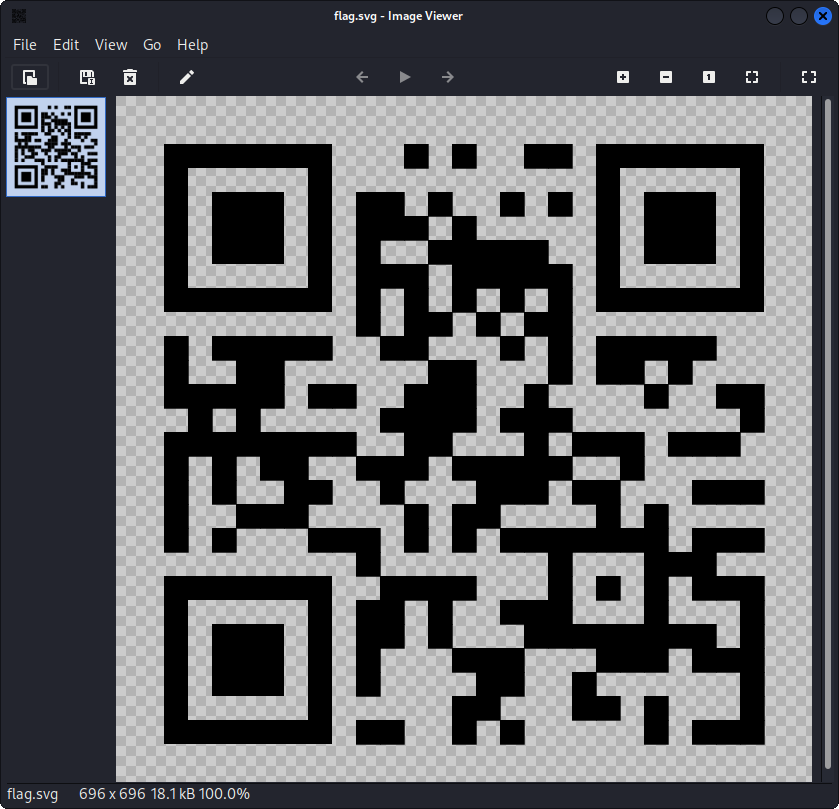

## light bulb

300 points

team: ninjas

<details> 
<summary>hint</summary>
Look into the encryption type
</details>



### getting started

First, we needed to connect to the wifi network with the credentials provided. We ran a host scan once connected to the network see what we could see. As expected, we could see other hosts connected to the network with MAC org identifiers (OUI) such as Apple, Lenovo and so on. What stuck out to us (and this took way longer than it should have) was that there was a host identified as Microsoft host with `CONTOSO` in it's hostname. This was hinted at in the challenge preamble.

So what now? We scanned that host of course. If we had paid attention the first time, we would have noticed that `ssh` was open on port `22` and then we fell into a rabbit hole thinking was this even the right host? We confirmed this via Wireshark where we could definitely confirm that is what we were talking to internally. Eventually we ran the scan again and figured, hey, let's just connect to the host via `ssh` [^1]. Maybe we'll get some more info? Let's `ssh` in. 

The banner says "this is a part of the CTF", oh it's asking us for creds. Duh. Looks like we'll need to brute force right? With the creds wordlist the CTF provided? Nope, with a lucky guess it was just `admin:admin`. After logging in with those credentials via ssh, we're presented with a greeting and menu options.

Unfortunately, we didn't capture screenshots of the light bulb interface via ssh so this crude recreation will have to do:

```
welcome to light bulb iot controller!

please select:

1. flash lightbulb 
2. ping host
3. version
4. exit

```
### owning the light bulb controller

After playing around with the controller (and making the light bulb flash a few times because why not?) the menu option that was most interesting to us was `2. ping host`. This would present a way to ping a device. It expected us to issue `ping` and seemed to block everything else. However, our team tried the good ol' command injection techniques and we were able to bypass this and perform arbitrary command execution. It looked something like this:

`ping 127.0.0.1; <any arbritary command>`

So, with this we listed the directory (`; ls /`) and noticed something juicy: `flag.blob`.

However, it was evident soon after  that this was some sort of jailed or emulated shell as many utilities that we normally expected were not present e.g `file` `base64` and so on, the contents of the command were also wiped from the terminal after a few seconds so every command we could only view the results for a couple of seconds. We tried to `scp` the file out of the box but because the shell was this light bulb interface it wouldn't work.

The main problem we had was that we could `cat` the file however the buffer would clear in about 3 seconds. After playing around with trying to get that file to our machine via reverse shells and other trickery, we just did something super low tech and relied on reflexes to copy and paste like the **ninjas** that we are. 

We now had the contents of `flag.blob` which was a big base64 encoded file that we needed to decode. We did that in the good ol' CyberChef and exported the file.

### cracking the code

By using a simple `From Base64` and `Detect File Type` recipe we saw it was indeed a `pkzip` file:



So after exporting this file (did I saw how useful cyberchef was before?) we now have an actual archive to work with. Might it contain the flag we're chasing? 

Much to our chagrin, and as expected, this was not the end of the road:

```
┌──(kali㉿kali)-[~/Desktop]
└─$ unzip something.pkzip
Archive:  something.pkzip
[something.pkzip] flag.svg password: 
password incorrect--reenter: 
```
It's password protected! But at least we know there's a flag in there 🤞.

At this stage, we were prepared to brute force it with the supplied ctf wordlist/s. However, time was running low and it just so happened that a hint was released. After looking at the hint:

> Look into the encryption type

We figured it wasn't just a simple bruteforce. This is where we went deeper into how the archive was encrypted that utilities like `file` were not giving us. 

A teammate went with `7z` to find more info:

```diff
┌──(kali㉿kali)-[~/Desktop]
└─$ 7z l -slt something.pkzip 

Scanning the drive for archives:
1 file, 18276 bytes (18 KiB)

Listing archive: something.pkzip

Path = something.pkzip
Type = zip
Physical Size = 18276

Path = flag.svg
Folder = -
Size = 18114
Packed Size = 18126
Modified = 2023-07-09 16:41:27
Created = 2023-07-09 16:41:26
Accessed = 2023-07-09 18:08:52
Attributes = A
Encrypted = +
Comment = 
CRC = 212461D2
+ Method = ZipCrypto Store
Host OS = FAT
Version = 20
Volume Index = 0

```
And there we have our next step - understanding what **ZipCrypto Store** is and if it can be exploited for us to extract the flag.

It turns out, ZipCrypto is a native encryption method on ZIP archives and has a serious flaw[^2]. All you need to know about the encrypted file is 12 bytes (in plaintext) for an attack to be constructed. In this case, we know the flag is a `.svg` file and therefore, we can construct known plaintext via known magic bytes and other file headers.

For this, we can use a tool called [`bkcrack`](https://github.com/kimci86/bkcrack)!

Summarised steps[^3]:

1. create plaintext file with xml file header
2. run bkcrack by supplying the password protected archive, the encrypted filename, and the known plaintext
3. wait for a little bit
4. grab the 3 encryption keys
5. using the 3 keys, set a new archive password
6. extract the file with the new password!
7. win

Run bkcrack

`$ ./bkcrack -C something.pkzip -c flag.svg -p plain.txt`

Obtain ciphers
```
└─$ bkcrack-1.5.0-Linux/bkcrack -C something.pkzip -c flag.svg -p plain.txt 
bkcrack 1.5.0 - 2022-07-07
[22:11:39] Z reduction using 13 bytes of known plaintext
100.0 % (13 / 13)
[22:11:39] Attack on 557044 Z values at index 6
Keys: 321fe156 785c1413 71d4c601
67.9 % (378198 / 557044)
[22:22:42] Keys
321fe156 785c1413 71d4c601

```

Use ciphers to create unlocked archive with `flag.svg`
```
└─$ bkcrack-1.5.0-Linux/bkcrack -C something.pkzip -k 321fe156 785c1413 71d4c601 -U flagpls.zip hunter123
bkcrack 1.5.0 - 2022-07-07
[22:31:18] Writing unlocked archive flagpls.zip with password "hunter123"
100.0 % (1 / 1)
Wrote unlocked archive.
```

```
└─$ unzip flagpls.zip                                                                                    
Archive:  flagpls.zip
[flagpls.zip] flag.svg password: 
 extracting: flag.svg  
```

### flag

It worked. We get our flag via the svg file but it appears to be a QR code:



Decoding it via the command line gives us the flag!

```
└─$ zbarimg flag.svg
QR-Code:flag{mz8RJd6U2D}
scanned 1 barcode symbols from 1 images in 0.09 seconds
```

🎉

`flag{mz8RJd6U2D}`

[^1]: In retrospect, we should have just thought more about it and realised the simpler option is the right option. More methodical scanning such as versioning, banner grabbing etc may have also taken us on the right track the first time.

[^2]: https://en.wikipedia.org/wiki/ZIP_(file_format)?useskin=vector#Encryption

[^3]: https://github.com/kimci86/bkcrack/blob/master/example/tutorial.md